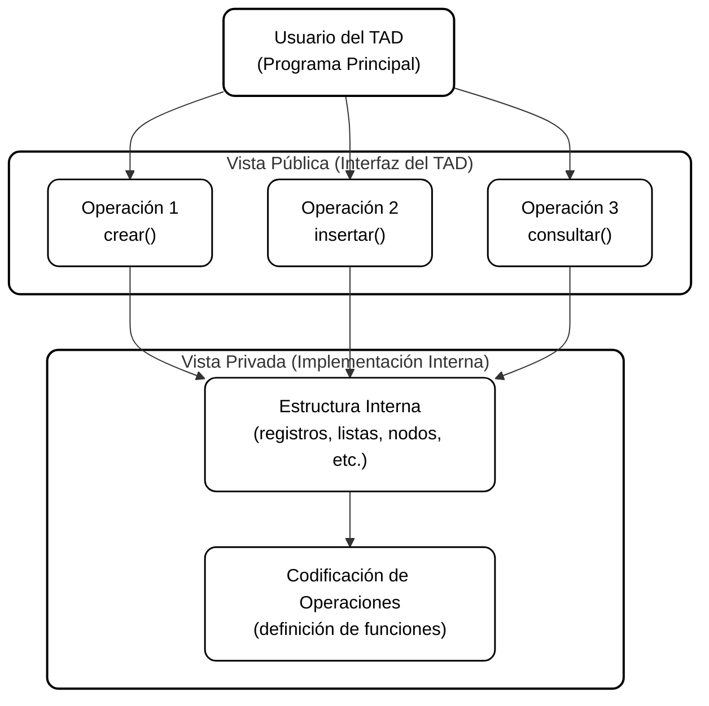

# Tipos Abstractos de Datos (TAD)

## Descripción General

Los **Tipos Abstractos de Datos (TAD)** constituyen un concepto esencial en la programación modular y el diseño de algoritmos.  
Su objetivo es **definir estructuras de datos basadas en su comportamiento y operaciones**, sin depender de su representación interna.

Un TAD combina dos ideas clave:
- **Abstracción:** separar la especificación (qué hace) de la implementación (cómo lo hace).  
- **Encapsulamiento:** ocultar los detalles internos al usuario del tipo.

De esta forma, el programador puede utilizar un TAD conociendo únicamente su **interfaz pública**, mientras que su **implementación privada** permanece invisible.

---

## 1. Concepto de Abstracción

El calificativo “abstracto” proviene del proceso de **abstracción**, que consiste en centrarse en lo esencial de una estructura, ignorando los detalles de su implementación.

| Enfoque | Descripción | Nivel de Acceso |
|----------|--------------|-----------------|
| **QUÉ (Vista Pública)** | Define el propósito del TAD, los valores posibles y las operaciones que se pueden realizar. | Usuario o programador de aplicación. |
| **CÓMO (Vista Privada)** | Especifica la estructura interna y cómo se implementan las operaciones. | Diseñador o desarrollador del TAD. |

El usuario solo necesita conocer el **QUÉ** (la especificación), sin preocuparse por el **CÓMO** (la implementación).

---

## 2. Componentes de un TAD

Un TAD se compone de dos vistas complementarias: una pública (interfaz) y otra privada (implementación).

### A. Vista Pública o Interfaz de Usuario
Es la parte visible del TAD, donde se define su **especificación**:

1. **Valores:** indican qué tipo de información puede almacenar el TAD.  
2. **Operaciones:** describen las acciones posibles (nombre, parámetros y propósito).  
3. **Requisitos de la especificación:** claridad, precisión y ausencia de ambigüedad.

### B. Vista Privada o del Diseñador
Corresponde a la **implementación interna** del TAD, que está oculta al usuario.

1. **Estructura interna:** determina cómo se representan los datos en memoria (por ejemplo, registros o listas).  
2. **Codificación:** define cómo se implementan las operaciones de la interfaz sobre la estructura interna elegida.

---

## 3. Tipos de Operaciones Fundamentales

Las operaciones que se aplican sobre un TAD son el único medio para manipular sus valores.  
Se clasifican en las siguientes categorías:

| Tipo de Operación | Función Principal | Ejemplo Conceptual |
|--------------------|------------------|--------------------|
| **Creación o Constructores** | Generan una nueva variable del tipo TAD. | Crear una pila vacía. |
| **Asignación de Valor** | Permiten cargar datos en la variable. | Cargar coordenadas en un punto. |
| **Consulta** | Devuelven información sin modificar el contenido. | Obtener la ordenada de un punto. |
| **Modificación** | Alteran los datos o su estructura interna. | Desapilar un elemento de una pila. |

Cada TAD define su propio conjunto de operaciones según el tipo de datos que represente.

---

## 4. Abstracción, Encapsulamiento y Ocultamiento

Dos conceptos fundamentales garantizan la independencia entre interfaz y representación:

### A. Encapsulamiento
Consiste en **empaquetar** la estructura interna y las operaciones en una unidad lógica.  
Esto permite que el usuario interactúe con el TAD solo mediante su interfaz.

### B. Ocultamiento de Datos
Impide el acceso directo a la representación interna o a la implementación de las operaciones.  
El usuario no puede modificar ni consultar los atributos internos sin utilizar las operaciones públicas.

> En lenguajes como C, el ocultamiento no es total, pero puede simularse mediante librerías y archivos de cabecera (`.h`).

---

## 5. Ventajas del Uso de TAD

El empleo de Tipos Abstractos de Datos aporta beneficios significativos en el desarrollo de software modular y escalable:

| Ventaja | Descripción |
|----------|-------------|
| **Independencia** | La manipulación del TAD depende solo de su especificación, no de su implementación. |
| **Flexibilidad** | Un mismo TAD puede tener múltiples implementaciones equivalentes. |
| **Transparencia de cambios** | Las modificaciones internas no afectan a los programas que lo usan. |
| **Reutilización** | Las especificaciones pueden compartirse entre distintos proyectos. |
| **Mantenibilidad** | Favorece la corrección y actualización del código. |

---

## 6. Inclusión y Uso en Aplicaciones

Para utilizar un TAD en un programa de aplicación se siguen los siguientes pasos:

| Etapa | Descripción | Ejemplo Conceptual |
|--------|--------------|--------------------|
| **1. Archivo de librería** | El TAD se implementa en un archivo independiente, generalmente con extensión `.h`. | `TAD_Pila.h` |
| **2. Inclusión** | El programa principal incluye el archivo del TAD mediante una instrucción. | `#include "TAD_Pila.h"` |
| **3. Declaración de variables** | Se declaran variables del tipo definido por el TAD. | `p1, p2 : PuntoDelPlano` |
| **4. Uso controlado** | El usuario accede al TAD solo a través de sus operaciones públicas. | Llamadas a funciones de la interfaz. |

---

## 7. Relación entre Interfaz e Implementación

El TAD actúa como un **contrato** entre el usuario y el diseñador:

- El **usuario** se compromete a utilizar las operaciones de la interfaz sin acceder a los detalles internos.  
- El **diseñador** garantiza que la implementación respeta las reglas establecidas por la especificación.

---

## 8. Representación Conceptual

### Esquema general del TAD

> En este diagrama se ilustra la separación entre la **vista pública (interfaz)** y la **vista privada (implementación)**.  
> La interfaz define las operaciones accesibles, mientras que la implementación gestiona los detalles internos de estructura y almacenamiento.

---

## 9. Conclusión

Un **Tipo Abstracto de Datos** es la base conceptual que permite diseñar software modular, reutilizable y mantenible.  
Su poder radica en la **abstracción** del comportamiento, la **independencia de la implementación** y el **aislamiento de los detalles internos**.  

Los TAD constituyen el fundamento sobre el cual se construyen las estructuras de datos más avanzadas, como pilas, colas, listas, árboles y grafos.