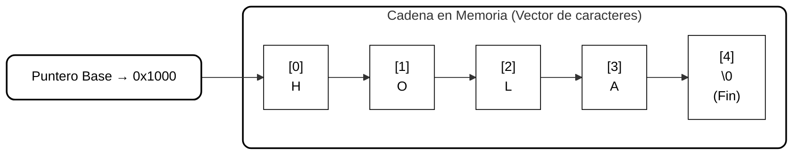

# Cadenas de Caracteres en C

## Descripción General

Las **cadenas de caracteres** son estructuras fundamentales en el lenguaje C utilizadas para representar texto.  
A diferencia de otros lenguajes de programación que poseen un tipo de dato específico para cadenas, en C las cadenas se implementan como **arreglos de caracteres (`char`)** que finalizan con un **carácter nulo (`\0`)**.  

Esta implementación de bajo nivel ofrece **gran control sobre la memoria**, pero exige una **gestión precisa y cuidadosa** por parte del programador.

---

## 1. Representación en Memoria

Las cadenas en C se almacenan como **bloques contiguos de memoria** donde cada celda representa un carácter individual.  
El nombre de la variable actúa como un **puntero al primer carácter** del arreglo, es decir, contiene la **dirección de inicio de la cadena**.

### Conceptos Clave

- **Arreglo de caracteres:**  
  Una cadena es un conjunto ordenado de elementos del tipo `char`, donde cada carácter ocupa una posición consecutiva en memoria.

- **Puntero base:**  
  El identificador de la cadena representa la dirección del primer elemento del arreglo, por lo que las operaciones sobre cadenas se basan en el manejo de punteros.

- **Terminador nulo (`\0`):**  
  Cada cadena finaliza con un byte especial de valor cero (`\0`) que marca el final lógico del texto.  
  Este carácter no se muestra ni cuenta como parte visible de la cadena, pero es esencial para su correcta interpretación.

- **Tamaño total:**  
  Si una cadena tiene `n` caracteres visibles, debe reservarse espacio para `n + 1` posiciones, incluyendo el terminador.

---

## 2. Naturaleza de Bajo Nivel

El modelo de cadenas en C refleja directamente la gestión de la **memoria física**.  
Cada carácter se almacena en una celda, y el lenguaje no impone restricciones automáticas sobre los límites de lectura o escritura.

### Implicaciones:

1. **Eficiencia y control total:**  
   Permite manipular directamente las posiciones de memoria mediante punteros.

2. **Riesgo de errores:**  
   Cualquier acceso fuera de los límites o la omisión del carácter nulo puede provocar corrupción de memoria o resultados impredecibles.

3. **Ausencia de gestión automática:**  
   El lenguaje no valida el tamaño de las cadenas ni controla desbordamientos.  
   La responsabilidad del programador es garantizar la coherencia de la estructura.

---

## 3. Entrada y Salida de Cadenas

C utiliza funciones estándar para la lectura e impresión de cadenas, las cuales emplean **formatos específicos**.

| Operación | Función | Formato | Observación |
|------------|----------|----------|--------------|
| Entrada | `scanf()` | `%s` | No se usa `&` porque el nombre del arreglo ya es un puntero. |
| Salida | `printf()` | `%s` | Interpreta la cadena hasta el carácter nulo. |

### Nota Importante
Cuando se utiliza `scanf()` con cadenas, **no debe anteponerse el operador `&`**.  
El identificador de la cadena ya contiene la dirección base, por lo que pasar `&` implicaría un acceso incorrecto a memoria.

---

## 4. Librería `<string.h>` y Funciones Fundamentales

La manipulación de cadenas requiere incluir la librería estándar **`<string.h>`**, que proporciona un conjunto de funciones específicas para su manejo.

| Función | Descripción Principal |
|----------|------------------------|
| `strlen()` | Calcula la longitud de la cadena (sin contar el `\0`). |
| `strcmp()` | Compara dos cadenas carácter por carácter. |
| `strcpy()` | Copia el contenido de una cadena en otra. |
| `strcat()` | Concatena una cadena al final de otra. |

**Aspecto crítico:**  
Estas funciones **no realizan verificación del tamaño del destino**, por lo que el programador debe asegurar que haya espacio suficiente antes de copiar o concatenar cadenas.

---

## 5. Errores Comunes

El trabajo con cadenas en C suele presentar errores derivados del control manual de memoria.  
Entre los más frecuentes se encuentran:

- **Falta de espacio para el carácter nulo (`\0`).**  
- **Arreglos sin inicializar o con memoria insuficiente.**  
- **Desbordamientos de búfer (buffer overflow)** al copiar cadenas demasiado largas.  
- **Omisión del carácter nulo** al construir o modificar cadenas manualmente.  
- **Uso incorrecto del operador `&`** al leer cadenas con `scanf()`.

Estos errores pueden generar fallos de ejecución o comportamientos no definidos.

---

## 6. Representación Conceptual

### Cadena en Memoria (Null-Terminated String)

> Interpretación:  La cadena se almacena como un bloque contiguo en memoria.  
Cada carácter ocupa una celda, y el último espacio contiene el terminador nulo (`\0`), que indica el fin de la secuencia.

---

## 7. Complejidad y Costos de Operaciones

| Operación | Complejidad Temporal | Descripción |
|------------|----------------------|--------------|
| Lectura / Escritura | O(n) | Recorre carácter por carácter. |
| Cálculo de longitud | O(n) | Avanza hasta el carácter nulo. |
| Comparación | O(n) | Compara caracteres hasta detectar diferencia o fin. |
| Copia / Concatenación | O(n) | Duplica o une los caracteres de una o más cadenas. |

En C, la mayoría de las operaciones con cadenas tienen costo lineal (**O(n)**), ya que requieren recorrer la secuencia completa hasta el terminador.

---

## 8. Cálculo del Uso de Memoria

El tamaño total de una cadena depende de la cantidad de caracteres y del byte adicional necesario para el carácter nulo.

$$
M = (n + 1) \times T_{\text{char}}
$$

Donde:

- **n:** cantidad de caracteres visibles.  
- **Tchar:** tamaño de un carácter (1 byte).  

**Ejemplo conceptual:**  
Una palabra de 4 caracteres ocupa 5 bytes en total: 4 para los caracteres visibles y 1 para el `\0`.

---

## 9. Ventajas

- Control total sobre la representación y la memoria.  
- Estructura simple y eficiente para operaciones básicas.  
- Base para estructuras más complejas como textos, buffers o archivos.  
- Compatibilidad directa con funciones del sistema y librerías estándar.  

---

## 10. Desventajas

- Riesgo alto de errores de memoria por falta de validaciones.  
- No permite redimensionamiento automático.  
- Mayor complejidad de manejo que los strings de alto nivel.  
- Requiere conocimiento preciso de punteros y direccionamiento.  

---

## Conclusión

Las **cadenas de caracteres en C** representan un ejemplo clásico de manejo manual de memoria.  
Su estructura basada en punteros y el carácter nulo proporciona **flexibilidad y eficiencia**, pero también exige una comprensión profunda del modelo de memoria.  

Dominar su funcionamiento es esencial para desarrollar programas **robustos, seguros y acordes con la filosofía del lenguaje C**.