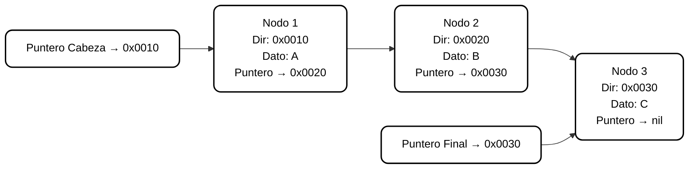

# Colas (Queues)

## Descripción General

Las **colas (queues)** son una estructura de datos **dinámica** que permite gestionar elementos de forma ordenada según una política de acceso estricta:  
**FIFO (First In, First Out)** — *Primero en entrar, primero en salir*.

A diferencia de las pilas o listas simples, las colas mantienen dos extremos bien definidos para la gestión de sus elementos:  
- **Inicio (Pin):** donde se eliminan los elementos.  
- **Final (Pfin):** donde se insertan nuevos elementos.  

Su implementación se basa generalmente en **listas encadenadas dinámicas**, utilizando **punteros** para permitir la asignación y liberación de memoria en tiempo de ejecución.

---

## 1. Política de Funcionamiento: FIFO

La principal característica de una cola es su política **FIFO (First-In, First-Out)**.  
Esto significa que el **primer elemento en ingresar** será también el **primero en salir**.

### Principio Fundamental
- El orden de llegada determina el orden de salida.  
- La cola mantiene un flujo unidireccional: los datos se insertan por un extremo y se eliminan por el otro.  

### Ejemplo Conceptual
Una cola se comporta como una **fila de personas en un supermercado**:  
quien llega primero será atendido antes, y las nuevas personas se agregan al final.

---

## 2. Estructura y Uso de Memoria

Las colas utilizan memoria **dinámica**, lo que les permite modificar su tamaño en tiempo de ejecución.  
Su implementación más común se apoya en **listas encadenadas**, donde cada nodo contiene un dato y un puntero al siguiente.

### A. Nodo (Elemento Base)

Cada nodo representa un elemento de la cola y está compuesto por:
- **Campo de datos:** almacena el valor o información del elemento.  
- **Puntero siguiente:** contiene la dirección del siguiente nodo en la secuencia.

Este diseño permite que los nodos estén distribuidos en posiciones **no contiguas** de la memoria.

### B. Estructura de Control (Registro de Cola)

La cola requiere un registro de control que gestione el acceso eficiente a sus extremos.  
Este registro mantiene dos punteros fundamentales:

| Puntero | Función Principal | Descripción |
|----------|------------------|--------------|
| **Pin**  | Acceso al inicio | Apunta al primer nodo de la lista (usado para eliminar o “desencolar”). |
| **Pfin** | Acceso al final  | Apunta al último nodo (usado para insertar o “encolar”). |

Cuando la cola está vacía, **ambos punteros se inicializan en `nil`**, indicando ausencia de elementos.

---

## 3. Operaciones Fundamentales

Las operaciones de una cola giran en torno a la manipulación controlada de sus dos extremos: **inicio y final**.  

| Operación | Objetivo | Mecanismo | Puntero/Memoria Implicada |
|------------|-----------|------------|----------------------------|
| **CrearCola** | Inicializar una cola vacía. | Se asigna `nil` a ambos punteros (`Pin` y `Pfin`). | Memoria de la estructura de control. |
| **Esvacía** | Verificar si la cola está vacía. | Se comprueba si `Pin = nil`. | No requiere acceso a nodos. |
| **Encolar** | Insertar un nuevo elemento al final. | Se crea un nuevo nodo dinámicamente. `Pfin` se actualiza al nuevo nodo. | Uso de memoria dinámica para el nuevo elemento. |
| **Desencolar** | Eliminar el primer elemento de la cola. | Se libera el nodo apuntado por `Pin`, y `Pin` avanza al siguiente nodo. Si `Pin` queda en `nil`, `Pfin` también se limpia. | Reasignación y liberación dinámica de memoria. |

---

## 4. Funcionamiento Interno y Eficiencia

Las colas aprovechan el direccionamiento mediante punteros para lograr **operaciones en tiempo constante (O(1))**, independientemente del tamaño de la estructura.

### A. Inserción (Encolar)
- El nuevo nodo se agrega directamente al final.  
- Gracias al puntero `Pfin`, **no es necesario recorrer toda la lista**.  
- El nodo anterior apunta al nuevo, y `Pfin` se actualiza para mantener el control del extremo final.

### B. Eliminación (Desencolar)
- Se toma el nodo apuntado por `Pin` (inicio).  
- Se libera su memoria y `Pin` se mueve al siguiente nodo.  
- Si la cola queda vacía (`Pin = nil`), se establece también `Pfin = nil`.  

### Analogía Visual
> Una cola se comporta como una cinta transportadora:  
> los nuevos elementos se agregan al final, y el primero que ingresó es el primero en salir.

---

## 5. Representación Conceptual

### FIFO Simple

---

> **Nota:**  
> Es altamente recomendable mantener un puntero adicional que apunte al último nodo (en este caso, el **Puntero Final**) dentro de la estructura de la cola.  
>  
> Esto se debe a que, si solo existiera el puntero al primer nodo (**Puntero Cabeza**), sería necesario recorrer toda la lista secuencialmente para ubicar el final antes de insertar un nuevo elemento, lo que implicaría un costo temporal de **O(n)**.  
>  
> Con la incorporación del puntero al último nodo, las operaciones de **inserción (Encolar)** se vuelven constantes en tiempo **O(1)**, sin importar la longitud de la cola, mejorando notablemente la eficiencia general de la estructura dinámica.

---

## 6. Complejidad y Eficiencia

| Operación | Complejidad Temporal | Descripción |
|------------|----------------------|--------------|
| **CrearCola** | O(1) | Inicialización inmediata. |
| **Esvacía** | O(1) | Comparación directa del puntero `Pin`. |
| **Encolar** | O(1) | Inserción directa gracias al puntero `Pfin`. |
| **Desencolar** | O(1) | Eliminación eficiente desde el inicio. |
| **Recorrido** | O(n) | Solo si se requiere inspeccionar todos los elementos. |

> Las colas son una de las pocas estructuras dinámicas donde **todas las operaciones principales tienen tiempo constante** gracias al uso simultáneo de `Pin` y `Pfin`.

---

## 7. Cálculo del Uso de Memoria

Cada nodo requiere espacio para almacenar su dato y su puntero.  
El tamaño total `M` para una cola con `n` elementos puede estimarse como:

$$
M = n \times (T_{\text{dato}} + T_{\text{puntero}})
$$

Donde:
- **Tdato** → tamaño del campo de datos.  
- **Tpuntero** → tamaño del puntero (dirección de memoria).  

**Ejemplo conceptual:**  
Si cada dato ocupa 4 bytes y cada puntero 8 bytes, entonces una cola con 5 elementos requerirá:

\[
M = 5 \times (4 + 8) = 60\ \text{bytes}
\]

---

## 8. Ventajas de las Colas

- Inserciones y eliminaciones en tiempo constante.  
- Uso eficiente y flexible de la memoria dinámica.  
- Orden natural de procesamiento (FIFO).  
- Base para estructuras más complejas (colas de prioridad, buffers, planificadores de tareas).

---

## 9. Desventajas

- No permiten acceso directo a posiciones intermedias.  
- Gestión más compleja que los arreglos estáticos.  
- Requieren control cuidadoso de punteros para evitar fugas de memoria.

---

## 10. Aplicaciones Prácticas

Las colas se aplican en numerosos contextos de la informática y los sistemas operativos:

- **Planificación de procesos (CPU Scheduling).**  
- **Gestión de trabajos en impresoras.**  
- **Simulación de líneas de espera (colas de atención).**  
- **Buffers de comunicación y redes.**  
- **Algoritmos de búsqueda (como BFS - Breadth-First Search).**

---

> **Conclusión:**  
> La **cola** es una estructura esencial para modelar sistemas de flujo y procesamiento secuencial.  
> Gracias a su naturaleza dinámica y su política FIFO, proporciona una gestión ordenada, eficiente y natural de los datos en memoria.