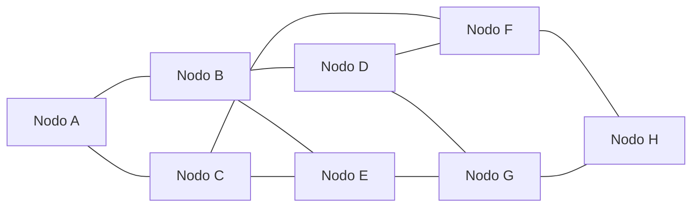

# Grafos

## Descripción General

Un **grafo** es una estructura de datos compuesta por un conjunto de **nodos (vértices)** y un conjunto de **aristas (enlaces)** que conectan dichos nodos.  
Se utiliza para modelar relaciones y estructuras complejas, como redes de comunicación, mapas o sistemas sociales.

> Analogía: Un grafo es como un **mapa de conexiones**, donde cada nodo es un punto de interés y cada arista representa una conexión entre puntos.

---

## 1. Componentes de un Grafo

| Componente | Descripción |
|------------|-------------|
| Nodos / Vértices | Elementos que representan entidades. |
| Aristas / Enlaces | Conexiones entre nodos; pueden ser dirigidas o no dirigidas. |

---

## 2. Aplicaciones en la vida real

| Contexto | Descripción |
|----------|-------------|
| Redes de computadoras | Nodos = dispositivos; aristas = conexiones de red. |
| Redes sociales | Nodos = usuarios; aristas = relaciones o amistades. |
| Transporte / Mapas | Nodos = ciudades; aristas = carreteras o rutas. |
| Sistemas de navegación | Modelar caminos y rutas óptimas. |
| Redes eléctricas | Nodos = generadores o transformadores; aristas = conexiones eléctricas. |

---

## 3. Implementación Conceptual

Para implementar un grafo se requieren principalmente **punteros o referencias dinámicas**:

| Estructura | Descripción |
|------------|-------------|
| Nodo del grafo | Contiene información del nodo y referencias a aristas adyacentes. |
| Arista | Representa la conexión entre nodos; tiene referencia a siguiente arista. |
| Grafo | Contiene referencia a la lista de nodos y cantidad total de nodos. |

> Ventaja: Permite agregar o eliminar nodos y aristas de manera dinámica sin reestructurar toda la memoria.

---

## 4. Representaciones de Grafos

| Representación | Características | Ventajas | Desventajas |
|----------------|----------------|----------|-------------|
| Matriz de Adyacencia | Tabla `n x n` que indica existencia de arista entre pares de nodos | Fácil de implementar; acceso rápido a aristas | Consume mucho espacio en grafos dispersos |
| Lista de Adyacencia | Arreglo de listas enlazadas con aristas de cada nodo | Eficiente en espacio para grafos dispersos; acceso rápido a vecinos | Verificar la existencia de aristas entre todos los nodos puede ser más lento |

### Representación Visual de un Grafo Más Complejo

---

> Grafo conceptual con 8 nodos y varias aristas.

---

## 5. Comparación: Matriz vs Lista de Adyacencia

| Característica | Matriz | Lista |
|----------------|--------|-------|
| Espacio | O(n²) | O(n + e) |
| Acceso a aristas | O(1) | O(d) |
| Inserción de aristas | O(1) | O(1) o O(d) |
| Recorrer adyacentes | O(n) | O(d) |
| Eficiencia en grafos dispersos | Baja | Alta |

---

## 6. Operaciones típicas de un grafo

| Operación | Descripción |
|-----------|-------------|
| Insertar nodo | Añadir un nuevo nodo al grafo |
| Eliminar nodo | Remover un nodo y todas sus aristas |
| Insertar arista | Añadir conexión entre dos nodos |
| Eliminar arista | Eliminar conexión entre nodos |
| Consultar nodo | Buscar un nodo específico |
| Recorrer grafo | Explorar nodos mediante recorridos conceptualizados como BFS o DFS |

---

## 7. Tipos de grafos

| Tipo | Características |
|------|----------------|
| No dirigido | Aristas sin dirección |
| Dirigido (DAG) | Aristas con dirección; no contiene ciclos |
| Ponderado | Cada arista tiene un peso asociado |
| Árbol | Grafo acíclico y conectado con un nodo raíz |
| Árbol de expansión mínima | Árbol con peso total mínimo de aristas |
| Bipartito | Nodos divididos en dos conjuntos; aristas solo entre conjuntos |
| Completo | Cada par de nodos conectado |
| k-DAG | Grafo dirigido acíclico con k dimensiones |

---

## 8. Tipos de búsquedas en grafos

| Algoritmo | Descripción | Uso conceptual |
|-----------|------------|----------------|
| BFS | Recorrido por niveles | Encontrar caminos más cortos en grafos no ponderados |
| DFS | Recorrido en profundidad | Explorar nodos a profundidad; detectar ciclos |
| Dijkstra | Camino más corto desde un nodo fuente | Grafos ponderados sin aristas negativas |
| Floyd-Warshall | Camino más corto entre todos los pares de nodos | Grafos densos |
| Bellman-Ford | Camino más corto con aristas negativas | Redes con costos negativos |
| Prim | Árbol de expansión mínima | Construcción de redes óptimas |
| Kruskal | Árbol de expansión mínima | Optimización de conexiones en redes |

---

## 9. Conclusión

Los **grafos** son estructuras fundamentales para modelar relaciones complejas y sistemas interconectados.  
La elección entre **lista de adyacencia** o **matriz de adyacencia** depende de la densidad del grafo y la eficiencia deseada.  
Los algoritmos de búsqueda y caminos mínimos permiten analizar estas estructuras para resolver problemas reales de redes, transporte y planificación.
