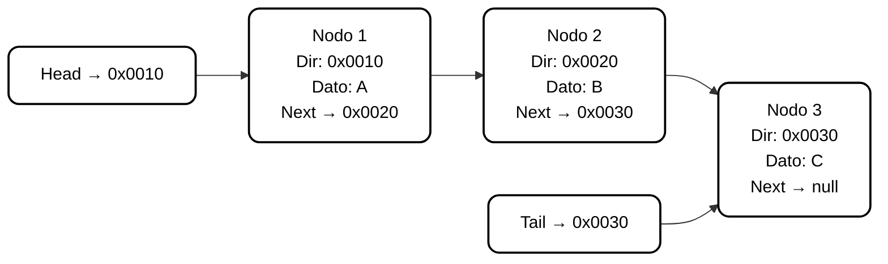
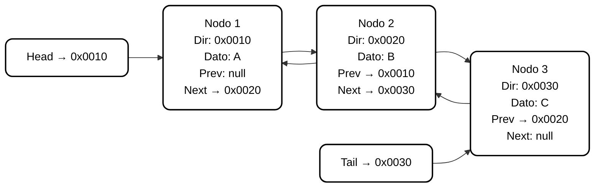
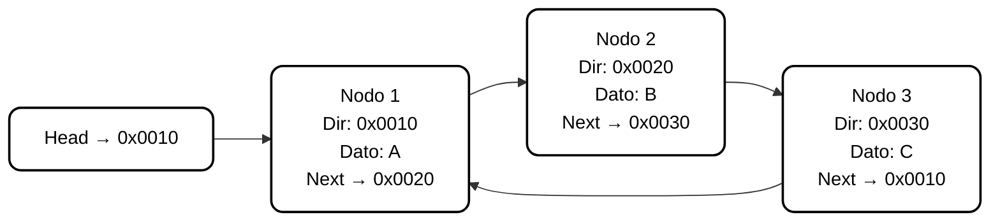

# Listas Encadenadas

## Descripción General

Las **listas encadenadas** son una de las estructuras de datos dinámicas más utilizadas en la programación.  
A diferencia de las estructuras estáticas, como los arreglos o vectores, las listas permiten **gestionar memoria de forma flexible** y **modificar su tamaño durante la ejecución del programa**.  

Su funcionamiento se basa en el uso de **punteros**, lo que permite crear secuencias de elementos almacenados en **posiciones no contiguas** de la memoria.  
Cada elemento o **nodo** de la lista contiene información y una referencia hacia el siguiente elemento, estableciendo así el encadenamiento.

---

## 1. Uso de Memoria y Naturaleza Dinámica

El principio fundamental de las listas encadenadas es el **direccionamiento mediante punteros**, que permite una gestión eficiente de la memoria y operaciones rápidas de inserción y eliminación.

### Conceptos Clave

- **Punteros y Direccionamiento:**  
  Un puntero es una variable que contiene una dirección de memoria. En las listas, los punteros permiten acceder a elementos dispersos en la memoria, estableciendo enlaces entre ellos.

- **Eficiencia en Memoria:**  
  Las listas utilizan únicamente la memoria necesaria para los elementos existentes, evitando el desperdicio de espacio y eliminando la necesidad de redimensionar estructuras, como ocurre con los arreglos.

- **Gestión Dinámica:**  
  Los elementos (nodos) se crean y destruyen durante la ejecución.  
  - **Creación:** Se reserva espacio en memoria para un nuevo nodo.  
  - **Liberación:** Se devuelve la memoria cuando un nodo deja de utilizarse.

- **Memoria Implicada:**  
  En toda operación con punteros existen dos entidades:  
  1. El puntero, que almacena la dirección.  
  2. El dato apuntado, que contiene el valor.  
  Todo ocurre en la **memoria principal (RAM)**.

---

## 2. Componentes de una Lista Encadenada

### A. Nodo

El **nodo** es la unidad básica de una lista encadenada. Está compuesto por:
- Un **campo de datos**, donde se almacena la información del elemento.  
- Un **campo puntero**, que contiene la dirección del siguiente nodo.  

Este diseño permite enlazar los elementos de manera dinámica, sin requerir posiciones contiguas en memoria.

### B. Puntero Cabeza (o Puntero Inicial)

El **puntero cabeza** es el elemento esencial de toda lista encadenada.  
Representa la **única referencia conocida** al primer nodo y constituye el **punto de acceso** a la lista completa.

#### Funciones Principales:
1. **Punto de Entrada:**  
   Es el primer acceso a la estructura. Desde el puntero cabeza se recorren todos los nodos de la lista.  
2. **Declaración:**  
   En la definición de la lista, el puntero cabeza es el que representa el inicio.  
   Cuando la lista está vacía, se inicializa con el valor especial **nulo (nil)**.  
3. **Gestión en Operaciones:**  
   - **Inserción al Principio:** el nuevo nodo pasa a ser el primer elemento y el puntero cabeza se actualiza para apuntar a él.  
   - **Eliminación de la Cabeza:** si se elimina el primer nodo, el puntero cabeza se redefine para apuntar al segundo elemento.  

El puntero cabeza puede verse como una **puerta de acceso**: si se pierde su dirección, se pierde la referencia a toda la lista.

### C. Marca de Fin de Lista

El último nodo de la lista contiene un puntero especial denominado **nulo (nil)**, que indica el final de la secuencia.  
Una lista vacía se representa cuando su puntero cabeza contiene **nil**.

---

## 3. Tipos de Listas Encadenadas

| Tipo de Lista | Dirección del Enlace | Punteros por Nodo | Recorrido | Aplicaciones Comunes |
|----------------|----------------------|-------------------|------------|----------------------|
| Simplemente Encadenada | Hacia adelante | 1 | En un solo sentido | Listas básicas, pilas |
| Doblemente Encadenada | Adelante y atrás | 2 | Bidireccional | Historiales, deshacer/rehacer |
| Circular | Último apunta al primero | 1 o 2 | Circular continua | Rondas, planificadores de CPU |

---

## 4. Aplicaciones de las Listas Encadenadas

Las listas sirven como base para múltiples estructuras dinámicas más avanzadas:

- **Pilas (Stacks):**  
  Siguen una política **LIFO (Last In, First Out)**.  
  Los elementos se agregan y eliminan por el mismo extremo, llamado *tope*.

- **Colas (Queues):**  
  Siguen una política **FIFO (First In, First Out)**.  
  Los elementos se agregan por un extremo (final) y se eliminan por el otro (inicio).

- **Estructuras Compuestas:**  
  Las listas pueden integrarse entre sí para formar estructuras como:  
  - **Vectores de listas:** cada posición de un vector apunta a una lista.  
  - **Listas de listas:** cada nodo contiene una referencia a otra lista.

---

## 5. Representación Gráfica

### Lista Enlazada

### Lista Doble

### Lista Circular

---

> **Nota:**  
> Es altamente recomendable mantener un puntero adicional que apunte al último nodo (en este caso, el **Puntero Final**) dentro de la estructura de la cola.  
>  
> Esto se debe a que, si solo existiera el puntero al primer nodo (**Puntero Cabeza**), sería necesario recorrer toda la lista secuencialmente para ubicar el final antes de insertar un nuevo elemento, lo que implicaría un costo temporal de **O(n)**.  
>  
> Con la incorporación del puntero al último nodo, las operaciones de **inserción (Encolar)** se vuelven constantes en tiempo **O(1)**, sin importar la longitud de la cola, mejorando notablemente la eficiencia general de la estructura dinámica.

---

## 6. Complejidad y Costos de Operaciones

| Operación | Complejidad Temporal | Descripción |
|------------|----------------------|--------------|
| Inserción al principio | O(1) | No requiere recorrido previo |
| Inserción al final | O(n) | Requiere recorrer hasta el último nodo |
| Eliminación al principio | O(1) | Simple actualización del puntero cabeza |
| Eliminación intermedia | O(n) | Necesita buscar el nodo previo |
| Búsqueda de elemento | O(n) | Requiere recorrido secuencial |

> **Nota:** La eficiencia depende de la posición del nodo y del tipo de lista (simple o doblemente encadenada).

---

## 7. Cálculo Estimado del Uso de Memoria

Cada nodo de una lista requiere espacio para el dato y para el puntero.  
Si se tienen `n` nodos, el espacio total `M` requerido puede aproximarse mediante:

$$
M = n \times (T_{\text{dato}} + T_{\text{puntero}})
$$

Donde:

- **Tdato** = tamaño del campo de datos  
- **Tpuntero** = tamaño del puntero (dirección de memoria)

**Ejemplo conceptual:**  
Si cada dato ocupa 4 bytes y cada puntero 8 bytes, entonces una lista con 5 nodos requerirá:

$$
M = 5 × (4 + 8) = 60 bytes
$$

---

## 8. Ventajas de las Listas Encadenadas

- Flexibilidad en el uso de memoria.  
- Inserciones y eliminaciones eficientes.  
- No requieren tamaño fijo.  
- Adaptables a diferentes tipos de estructuras dinámicas.  
- Ideales para aplicaciones donde la cantidad de datos varía durante la ejecución.

---

## 9. Desventajas

- Acceso secuencial: no se puede acceder directamente a un elemento específico.  
- Mayor complejidad de manejo comparado con los arreglos.  
- Uso adicional de memoria por los punteros.  
- Requieren una gestión cuidadosa de memoria dinámica para evitar fugas (*memory leaks*).
