# Matrices (Arreglos Bidimensionales)

## Descripción General

Las **matrices** son estructuras de datos **estáticas y homogéneas** que permiten almacenar y gestionar colecciones de elementos en **dos dimensiones**: filas y columnas.  
Cada elemento se accede mediante **dos índices**, lo que facilita su manipulación directa y organizada.

A diferencia de vectores o listas dinámicas, las matrices tienen un **tamaño fijo** definido por el número de filas y columnas, y no puede cambiar durante la ejecución del programa.  

> Analogía: Una matriz es como una **hoja de cálculo estática**, donde cada celda se identifica por su fila y columna.

---

## 1. Estructura y Conceptos Básicos

| Concepto | Descripción |
|----------|-------------|
| Homogénea | Todos los elementos son del mismo tipo. |
| Bidimensional | Se accede mediante fila y columna. |
| Finita | Número limitado de filas y columnas. |
| Ordenada | Cada elemento tiene una posición específica en la cuadrícula. |
| Dimensión | Producto del número de filas por columnas (N×M). |
| Memoria | Elementos almacenados en posiciones contiguas de la RAM, fila por fila. |

---

## 2. Operaciones Básicas

| Operación | Descripción |
|-----------|-------------|
| Asignación | Establecer un valor en un elemento específico o inicializar toda la matriz. |
| Recorrido | Procesar o mostrar los elementos fila por fila y columna por columna. |
| Inicialización | Asignar un valor predeterminado a todos los elementos. |

> Nota: Las matrices se recorren generalmente con **bucles anidados** debido a su naturaleza bidimensional.

---

## 3. Representación Conceptual de la Matriz

### Matriz en Memoria

```mermaid
graph LR
    %% --- PUNTERO BASE ---
    Ptr["Puntero Base → 0x2000"]

    %% --- BLOQUE DE MEMORIA POR FILAS ---
    subgraph Memoria["Matriz en Memoria (4x3)"]
        %% Fila 1
        A1["[0,0]<br/>5"]
        A2["[0,1]<br/>8"]
        A3["[0,2]<br/>2"]
        %% Fila 2
        B1["[1,0]<br/>7"]
        B2["[1,1]<br/>1"]
        B3["[1,2]<br/>6"]
        %% Fila 3
        C1["[2,0]<br/>3"]
        C2["[2,1]<br/>9"]
        C3["[2,2]<br/>4"]
        %% Fila 4
        D1["[3,0]<br/>0"]
        D2["[3,1]<br/>11"]
        D3["[3,2]<br/>12"]
    end

    %% --- ENLACES ENTRE PUNTERO Y FILA 1 ---
    Ptr --> A1

    %% --- ENLACES SECUENCIALES POR FILA ---
    A1 --> A2 --> A3 --> B1 --> B2 --> B3 --> C1 --> C2 --> C3 --> D1 --> D2 --> D3

    %% --- ESTILOS GENERALES ---
    style Memoria fill:#ffffff,stroke:#000000,stroke-width:2px,rx:10,ry:10
    style Ptr fill:#ffffff,color:#000000,stroke:#000000,stroke-width:2px,rx:10,ry:10
    style A1 fill:#ffffff,color:#000000,stroke:#000000,stroke-width:1px
    style A2 fill:#ffffff,color:#000000,stroke:#000000,stroke-width:1px
    style A3 fill:#ffffff,color:#000000,stroke:#000000,stroke-width:1px
    style B1 fill:#ffffff,color:#000000,stroke:#000000,stroke-width:1px
    style B2 fill:#ffffff,color:#000000,stroke:#000000,stroke-width:1px
    style B3 fill:#ffffff,color:#000000,stroke:#000000,stroke-width:1px
    style C1 fill:#ffffff,color:#000000,stroke:#000000,stroke-width:1px
    style C2 fill:#ffffff,color:#000000,stroke:#000000,stroke-width:1px
    style C3 fill:#ffffff,color:#000000,stroke:#000000,stroke-width:1px
    style D1 fill:#ffffff,color:#000000,stroke:#000000,stroke-width:1px
    style D2 fill:#ffffff,color:#000000,stroke:#000000,stroke-width:1px
    style D3 fill:#ffffff,color:#000000,stroke:#000000,stroke-width:1px
```

---

## 4. Recorrido de Matrices

| Tipo de Recorrido | Bucle Exterior | Bucle Interior | Descripción |
|------------------|----------------|----------------|-------------|
| Por filas | Filas (I) | Columnas (J) | Recorrido estándar, fila por fila. |
| Por columnas | Columnas (J) | Filas (I) | Recorrido vertical, útil para procesamiento de columnas. |

> También se pueden recorrer filas o columnas específicas, diagonales, o posiciones pares/impares según la necesidad.

---

## 5. Métodos de Ordenamiento

- Se pueden ordenar **filas completas** basándose en una columna específica como clave.  
- Se usan bucles anidados con métodos simples como selección o burbuja.  
- Los intercambios implican mover **todas las columnas de la fila** para preservar la coherencia de los datos.

---

## 6. Métodos de Búsqueda

| Método | Descripción | Complejidad |
|--------|------------|-------------|
| Secuencial | Recorre los elementos uno por uno hasta encontrar la clave. | O(N×M) |
| Basada en columna | Busca dentro de una columna específica o en toda la matriz según criterio. | O(N×M) |

> La búsqueda binaria solo se puede aplicar si la **columna clave está ordenada**.

---

## 7. Matrices en Contextos Compuestos

| Contexto | Descripción |
|----------|-------------|
| Tablas de datos | Cada fila representa un elemento, cada columna una propiedad. |
| Matrices de registros | Cada elemento puede ser un registro complejo con múltiples campos. |
| Modularización | Las matrices pueden pasarse a subprogramas para procesarlas o modificarlas. |
| Recursión | Se pueden usar en algoritmos recursivos de “divide y vencerás”. |

---

## 8. Ventajas de las Matrices
- Organización **bidimensional**, fácil de visualizar.  
- Acceso directo mediante **índices de fila y columna**.  
- Adecuadas para **procesamiento sistemático** y algoritmos de manipulación de tablas.  
- Base para estructuras más complejas: **imágenes, grafos, tablas dinámicas en memoria**.

---

## 9. Desventajas
- Tamaño **fijo** y **no dinámico**.  
- Recorrer toda la matriz puede ser **costoso** en tiempo.  
- Operaciones de inserción o eliminación son complejas si se requiere mover filas completas.

---

## 10. Aplicaciones
- Hojas de cálculo y **tablas de datos internas**.  
- Procesamiento de **imágenes y gráficos**.  
- Algoritmos matemáticos, científicos y de simulación.  
- Representación de **grafos y redes** mediante matrices de adyacencia.  

---

## 11. Conclusión

Las **matrices** son estructuras estáticas esenciales para organizar información en **dos dimensiones**.  
Permiten **acceso directo rápido**, son eficientes para procesamiento secuencial y algoritmos de búsqueda/ordenamiento sobre filas o columnas, pero su tamaño fijo exige planificación previa de la memoria.
