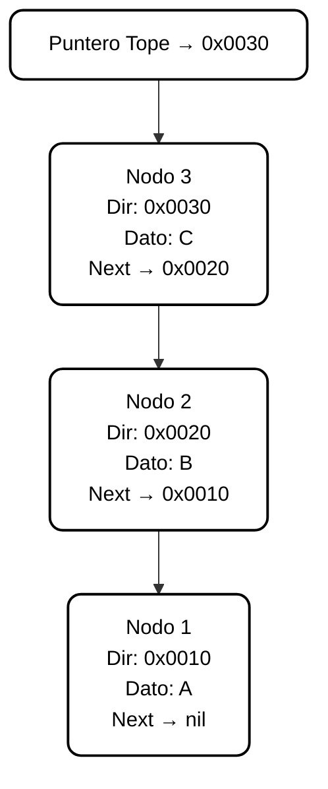

# Pilas (Stacks)

## Descripción General

Las **pilas (stacks)** son una estructura de datos **dinámica** que permite gestionar elementos según una política de acceso **LIFO (Last In, First Out)** — *Último en entrar, primero en salir*.  

A diferencia de las colas o listas simples, las pilas operan con **un único punto de acceso**, denominado **tope**, desde donde se realizan tanto las inserciones como las eliminaciones.  

Su implementación se basa generalmente en **listas encadenadas dinámicas**, utilizando **punteros** para administrar la memoria de manera flexible durante la ejecución.

---

## 1. Política de Funcionamiento: LIFO

La característica principal de una pila es su política **LIFO (Last-In, First-Out)**.  
Esto significa que el **último elemento insertado** será también el **primero en ser retirado**.

### Principio Fundamental
- Solo existe **un punto de acceso** a la estructura: el **tope**.  
- Las operaciones se realizan exclusivamente sobre este extremo.  
- El orden de salida de los datos es inverso al orden de entrada.

### Ejemplo Conceptual
Una pila se comporta como una **pila de platos**:  
solo se puede tomar o colocar el plato que está en la parte superior.  
El último plato que se apila es siempre el primero que se retira.

---

## 2. Estructura y Uso de Memoria

Las pilas se almacenan en **memoria dinámica**, lo que les permite crecer o reducirse según las necesidades del programa.  
Su implementación más común utiliza **nodos encadenados**, donde cada nodo contiene un dato y un puntero al siguiente nodo.

### A. Nodo (Elemento Base)

Cada nodo representa un elemento de la pila y está compuesto por:
- **Campo de datos:** contiene el valor almacenado.  
- **Puntero siguiente:** almacena la dirección del nodo inmediatamente inferior en la pila.

De esta forma, los nodos pueden ubicarse en posiciones **no contiguas** dentro de la memoria.

### B. Estructura de Control (Registro de Pila)

La pila se gestiona mediante un único puntero principal:

| Puntero | Función Principal | Descripción |
|----------|------------------|--------------|
| **Ptope** | Acceso al tope | Apunta al último nodo insertado (tope de la pila). Todas las operaciones se realizan desde este nodo. |

Cuando la pila está vacía, **el puntero `Ptope` se inicializa en `nil`**, indicando ausencia de elementos.

---

## 3. Operaciones Fundamentales

Las operaciones de una pila giran en torno a la manipulación del **tope**, único punto de acceso a los datos.

| Operación | Objetivo | Mecanismo | Puntero/Memoria Implicada |
|------------|-----------|------------|----------------------------|
| **CrearPila** | Inicializar una pila vacía. | Se asigna `nil` al puntero `Ptope`. | Memoria de la estructura de control. |
| **Esvacía** | Verificar si la pila está vacía. | Se comprueba si `Ptope = nil`. | No requiere acceso a nodos. |
| **Apilar (Push)** | Insertar un nuevo elemento en el tope. | Se crea un nuevo nodo dinámicamente; su puntero apunta al nodo que era el tope, y `Ptope` se actualiza al nuevo nodo. | Uso de memoria dinámica para el nuevo elemento. |
| **Desapilar (Pop)** | Eliminar el elemento del tope. | Se guarda la dirección del nodo superior, `Ptope` avanza al siguiente nodo y se libera la memoria del nodo eliminado. | Reasignación y liberación dinámica de memoria. |

---

## 4. Funcionamiento Interno y Eficiencia

El uso de punteros permite que las operaciones de una pila se realicen en **tiempo constante (O(1))**, sin importar el número de elementos almacenados.

### A. Inserción (Apilar)
- Se crea un nuevo nodo en memoria dinámica.  
- El puntero del nuevo nodo apunta al anterior tope.  
- `Ptope` se actualiza al nuevo nodo.  

La pila crece desde el tope, manteniendo la eficiencia en la inserción.

### B. Eliminación (Desapilar)
- Se accede directamente al nodo apuntado por `Ptope`.  
- Se libera su memoria.  
- `Ptope` se redefine al siguiente nodo de la lista.  

Si luego de la eliminación `Ptope = nil`, la pila queda vacía.

### Analogía Visual
> Una pila se comporta como una torre de libros:  
> se pueden agregar o retirar elementos únicamente desde la parte superior.

---

## 5. Representación Conceptual

La pila (stack) puede visualizarse como una secuencia de nodos enlazados dinámicamente, donde el **puntero Tope** siempre apunta al último elemento agregado.  
Las operaciones **Apilar** y **Desapilar** se realizan exclusivamente sobre este extremo.

### Estructura LIFO (Last-In, First-Out)

## 6. Aplicación Conceptual: Pila de Ejecución y Recursión

Un ejemplo clásico del uso de pilas es el **control de llamadas a funciones** dentro de un programa, especialmente durante la **recursión**.

Cada vez que una función se invoca, el sistema reserva un espacio en memoria (Registro de Activación) que se **apila** en la **pila de ejecución**.  
Cuando la función termina, ese registro se **desapila**, liberando su espacio.

### Características de la pila de ejecución:
- Cada llamada recursiva genera un nuevo contexto apilado.  
- El caso base detiene la recursión.  
- Las funciones retornan en orden inverso al de su llamada (LIFO).  
- Al desapilar, se recupera el estado previo del programa.  

Este mecanismo es esencial para la **recursión**, el **backtracking** y la **gestión de contextos locales**.

---

## 7. Complejidad y Eficiencia

| Operación | Complejidad Temporal | Descripción |
|------------|----------------------|--------------|
| **CrearPila** | O(1) | Inicialización directa. |
| **Esvacía** | O(1) | Comparación del puntero `Ptope`. |
| **Apilar** | O(1) | Inserción directa en el tope. |
| **Desapilar** | O(1) | Eliminación directa desde el tope. |
| **Recorrido** | O(n) | Solo si se requiere examinar todos los elementos. |

> Las pilas son altamente eficientes: todas las operaciones fundamentales se ejecutan en **tiempo constante**, sin necesidad de recorrer la estructura completa.

---

## 8. Cálculo del Uso de Memoria

Cada nodo requiere espacio para su dato y su puntero.  
El tamaño total `M` para una pila con `n` elementos puede estimarse como:

$$
M = n \times (T_{\text{dato}} + T_{\text{puntero}})
$$

Donde:  
- **Tdato** → tamaño del campo de datos.  
- **Tpuntero** → tamaño del puntero en memoria.

**Ejemplo conceptual:**  
Si cada dato ocupa 4 bytes y cada puntero 8 bytes, una pila con 5 elementos requerirá:

$$
M = 5 \times (4 + 8) = 60\ \text{bytes}
$$

---

## 9. Ventajas de las Pilas

- Inserciones y eliminaciones en tiempo constante (**O(1)**).  
- Uso eficiente de memoria dinámica.  
- Control simple mediante un único puntero (`Ptope`).  
- Implementación directa de la recursión y el backtracking.  
- Estructura base para compiladores, analizadores y sistemas de control.

---

## 10. Desventajas

- No permiten acceso directo a posiciones intermedias.  
- Gestión de memoria más compleja que las estructuras estáticas.  
- Riesgo de desbordamiento de pila si no se controla el tamaño en entornos recursivos.  
- Requieren liberar explícitamente la memoria al desapilar.

---

## 11. Aplicaciones Prácticas

Las pilas se utilizan ampliamente en contextos donde el orden inverso de procesamiento es esencial:

- **Evaluación de expresiones (notación polaca inversa).**  
- **Gestión de llamadas a funciones y recursión.**  
- **Navegadores (historial de páginas visitadas).**  
- **Deshacer/Rehacer en editores de texto.**  
- **Algoritmos de backtracking (búsqueda en laberintos, DFS, etc.).**

---

> **Conclusión:**  
> La **pila** es una estructura de datos fundamental en la programación y en el funcionamiento interno de los sistemas.  
> Su política **LIFO** y su eficiencia en tiempo **O(1)** la convierten en una herramienta esencial para el control de flujo, la gestión de memoria y la resolución recursiva de problemas.
