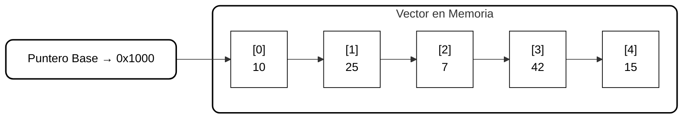

# Vectores (Arreglos Unidimensionales)

## Descripción General

Los **vectores** son estructuras de datos **estáticas** que permiten almacenar y gestionar colecciones de elementos de forma ordenada.  
Cada elemento es accesible mediante un **índice** o posición, lo que facilita su manipulación directa.

A diferencia de las colas o listas dinámicas, los vectores tienen un **tamaño fijo** que se define al declararlos y no puede cambiar durante la ejecución del programa.  

> Analogía: Un vector es como un **cajón de archivos numerado**, donde cada etiqueta (índice) apunta a un expediente (elemento) en una posición fija y contigua de la memoria.

---

## 1. Estructura y Conceptos Básicos

| Concepto | Descripción |
|----------|-------------|
| Homogéneo | Todos los elementos son del mismo tipo. |
| Finito | Número limitado de elementos. |
| Ordenado | Cada elemento tiene una posición específica. |
| Acceso por índice | Se accede a los elementos usando un número entero que indica su posición. |
| Dimensión | También llamado tamaño o rango, define la cantidad total de elementos. |
| Memoria | Elementos almacenados en posiciones contiguas de la RAM. |

---

## 2. Operaciones Básicas

| Operación | Descripción |
|-----------|-------------|
| Asignación | Establecer un valor en un elemento específico o en todos los elementos. |
| Recorrido | Procesar o mostrar los elementos uno a uno. |
| Inicialización | Asignar un valor predeterminado a todos los elementos. |

> Nota: Los vectores se recorren generalmente con estructuras repetitivas debido a su naturaleza secuencial.

---

## 3. Representación Conceptual del Vector

### Vector en Memoria (Mermaid)

---

## 4. Métodos de Ordenamiento

Los métodos de ordenamiento permiten organizar los elementos según un criterio definido.

| Método | Descripción | Complejidad |
|--------|------------|-------------|
| Selección | Encuentra el mínimo en cada pasada e intercambia posiciones. | O(N²) |
| Burbuja | Compara elementos adyacentes e intercambia si están desordenados. | O(N²) |
| Inserción | Inserta cada elemento en su posición correcta desplazando los demás. | O(N²) |

> Para grandes volúmenes de datos se utilizan métodos más eficientes como **Quicksort** o **Mergesort**.

---

## 5. Métodos de Búsqueda

| Método | Descripción | Complejidad |
|--------|------------|-------------|
| Secuencial | Recorre los elementos uno por uno hasta encontrar la clave. | O(N) |
| Binaria | Divide el vector ordenado en mitades sucesivas hasta localizar la clave. | O(log N) |

> La búsqueda binaria requiere que el vector esté **previamente ordenado**.

---

## 6. Vectores en Contextos Compuestos

| Contexto | Descripción |
|----------|-------------|
| Vectores paralelos | Dos o más vectores relacionados por índice, procesados simultáneamente. |
| Arreglos de registros | Cada elemento es un registro con varios campos; se accede por índice y campo. |
| Modularización | Los vectores pueden pasarse a subprogramas para ser procesados o modificados. |
| Recursión | Se pueden usar en algoritmos recursivos como “divide y vencerás”. |

---

## 7. Ventajas de los Vectores
- Acceso **directo** a elementos mediante índice.  
- Estructura **contigua**, fácil de procesar.  
- Adecuado para **algoritmos de ordenamiento y búsqueda**.  
- Útil en **modularización y recursión**.

---

## 8. Desventajas
- Tamaño **fijo** y **no dinámico**.  
- Requiere conocer previamente el número máximo de elementos.  
- Insertar o eliminar elementos puede ser costoso si requiere mover muchos datos.

---

## 9. Aplicaciones
- Procesamiento de **listas de datos**: números, nombres, registros.  
- Implementación de algoritmos de **ordenamiento y búsqueda**.  
- Base para estructuras más complejas como **matrices, pilas y colas**.  
- **Vectores de registros** para bases de datos internas en memoria.

---

## 10. Conclusión

Los **vectores** son estructuras estáticas esenciales para almacenar datos de manera **ordenada y contigua**.  
Permiten **acceso directo rápido**, son eficientes para procesamiento secuencial y algoritmos de ordenamiento/búsqueda, pero su tamaño fijo exige planificación previa del almacenamiento requerido.